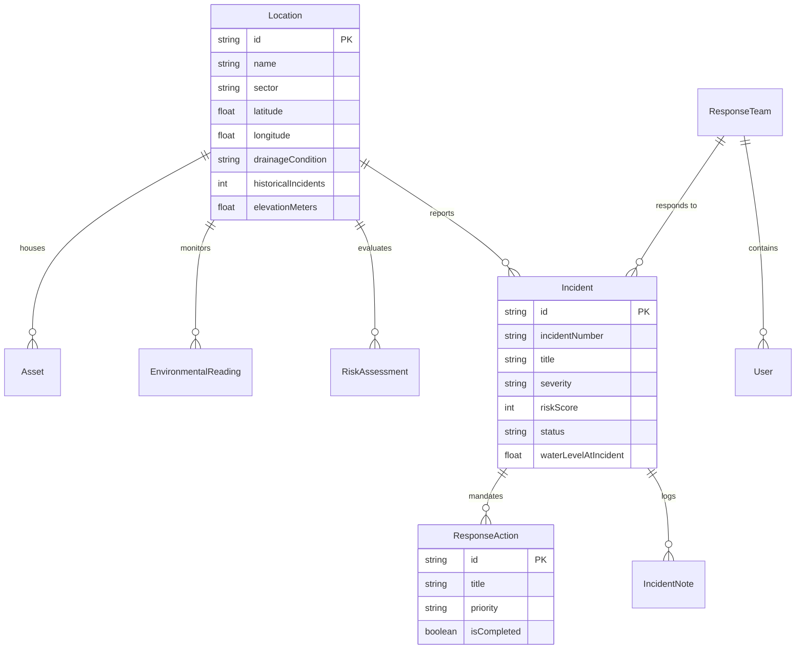

# ClimateShield — Urban Climate Risk & Resilience Platform MVP

> **Operational Climate-Risk & Resilience Platform for Municipal Disaster Management**  
> Built for the 24-hour Smart Cities & Climate Tech Hackathon.

---

## 1. Product Overview

**ClimateShield** helps municipal disaster-management directors, civil engineers, and infrastructure operations teams understand localized climate risks and turn live environmental telemetry into rapid, actionable response workflows.

Unlike generic weather forecasting applications, ClimateShield is an operational command platform. Its core architecture demonstrates:

$$\text{Environmental Data} \longrightarrow \text{Risk Assessment} \longrightarrow \text{Vulnerable Location / Asset} \longrightarrow \text{Alert} \longrightarrow \text{Recommended Action} \longrightarrow \text{Response Dispatch} \longrightarrow \text{Resolution}$$

For this MVP, ClimateShield focuses primarily on **urban flood and pluvial waterlogging risks** across municipal infrastructure corridors (underpasses, arterial transit roads, hospitals, and commercial sectors).

---

## 2. Problem Being Solved

Municipal authorities often receive broad regional weather forecasts that lack hyper-localized, asset-specific context. During sudden cloudbursts:
- Water accumulates in arterial underpasses and sub-grade corridors within 15–30 minutes.
- Response teams are dispatched reactively after vehicles are already stranded or emergency hospital routes are cut off.
- Operational checklists, field communication, and mitigation directives are scattered across disconnected channels.

ClimateShield solves this by combining localized environmental telemetry with a transparent hydraulic scoring engine and structured incident response workflows.

---

## 3. Key Features

- **Google Stitch Precision UI**: Faithfully recreates the Google Stitch design system, including Space Grotesk and Geist typography, custom color tokens, hairline blueprint dividers, radar sweeps, and micro-animations.
- **Operations Dashboard**: Real-time KPI cards (Overall Risk Index 72 HIGH, 3 Critical Zones, 5 Active Incidents, 18 Vulnerable Assets), GIS basemap preview, priority alerts, and actionable mitigation directives.
- **Interactive GIS Risk Map**: Leaflet and React-Leaflet map with color-coded risk markers (Low, Medium, High, Critical), hazard filters, infrastructure asset toggles, and floating hotspot telemetry cards.
- **Transparent Flood-Risk Engine**: 4-factor formula (30% Rainfall + 30% Water Level + 20% Drainage Condition + 20% Historical Incidents) calculating standardized 0–100 risk scores, risk tiers, factor impact explanations, and mitigation actions.
- **Location Risk Details**: In-depth telemetry breakdown for hotspots (e.g., Railway Underpass at 87/100 CRITICAL), water depth trajectories, assets at immediate stake, and one-click incident creation.
- **Incident Response Workflow**: 5-step lifecycle stepper (Risk Detected $\rightarrow$ Alert Sent $\rightarrow$ Team Assigned $\rightarrow$ Response In Progress $\rightarrow$ Resolved), interactive response protocol checklists, encrypted field updates log, response team assignment, and one-click resolution.
- **Risk History & Resilience Planning**: 12-month monsoonal surge trend visualizer, recurring hotspots audit table, and municipal capital allocation directives.

---

## 4. Tech Stack

### Frontend
- **Framework**: React 18 with TypeScript
- **Tooling**: Vite 5
- **Routing**: React Router DOM v6
- **Styling**: Tailwind CSS (with Google Stitch design tokens)
- **Icons**: Lucide Icons & Material Symbols Outlined
- **Mapping**: Leaflet & React-Leaflet with OpenStreetMap cartography

### Backend
- **Runtime**: Node.js v20+ / v24+
- **Server**: Express with TypeScript
- **Execution & Hot Reloading**: TSX
- **API Architecture**: RESTful endpoints with structured error responses

### Database & ORM
- **Database**: PostgreSQL (production-ready) with zero-config SQLite dual setup for instant local evaluation
- **ORM**: Prisma ORM v5
- **Seed Script**: Automated database seeding with realistic telemetry, assets, and teams

---

## 5. Folder Structure

```
Weather/
├── frontend/
│   ├── index.html
│   ├── vite.config.ts
│   ├── tailwind.config.js
│   ├── postcss.config.js
│   ├── tsconfig.json
│   ├── package.json
│   └── src/
│       ├── components/
│       │   ├── layout/       # Sidebar, Header, AppLayout
│       │   ├── map/          # RiskMapView (Leaflet GIS)
│       │   └── common/       # SeverityBadge, TelemetryPills
│       ├── pages/
│       │   ├── Login.tsx
│       │   ├── Dashboard.tsx
│       │   ├── RiskMap.tsx
│       │   ├── RiskDetails.tsx
│       │   ├── IncidentResponse.tsx
│       │   └── RiskHistory.tsx
│       ├── services/
│       │   ├── api.ts
│       │   ├── locationService.ts
│       │   ├── riskService.ts
│       │   └── incidentService.ts
│       ├── types/            # Shared TypeScript interfaces
│       ├── App.tsx           # Route guards and router
│       ├── main.tsx
│       └── index.css         # Stitch design tokens & radar keyframes
│
├── backend/
│   ├── tsconfig.json
│   ├── package.json
│   ├── prisma/
│   │   ├── schema.prisma     # Prisma models & relations
│   │   ├── seed.ts           # Telemetry & incident seed data
│   │   └── dev.db            # Local database instance
│   └── src/
│       ├── config/           # Prisma client config
│       ├── controllers/      # Auth, Location, Risk, Incident, History
│       ├── routes/           # REST API routing
│       ├── services/
│       │   ├── risk/         # Transparent Flood-Risk Engine
│       │   ├── locations/    # Location data provider
│       │   └── incidents/    # Incident lifecycle management
│       ├── types/            # Backend types
│       ├── app.ts            # Express setup and CORS
│       └── server.ts         # Server entry point
│
├── stitch_reference/         # Extracted Google Stitch design artifacts
├── .env.example
├── README.md
└── package.json              # Monorepo root with concurrently scripts
```

---

## 6. Database Schema Overview



---

## 7. REST API Endpoints

| Method | Endpoint | Description |
| :--- | :--- | :--- |
| `POST` | `/api/auth/login` | Operator authentication (demo credentials supported) |
| `GET` | `/api/locations` | List all monitored zones with live calculated risk |
| `GET` | `/api/locations/:id` | Detailed location metadata, assets, and readings |
| `GET` | `/api/risk/:locationId` | Dynamic hydraulic risk calculation and factor breakdown |
| `POST` | `/api/risk/calculate` | Test arbitrary environmental inputs against the risk engine |
| `GET` | `/api/incidents` | List all logged and active incidents |
| `GET` | `/api/incidents/:id` | Full incident details with actions, team, and notes |
| `POST` | `/api/incidents` | Declare and dispatch a new incident |
| `PATCH`| `/api/incidents/:id` | Update incident status (`RESPONSE_IN_PROGRESS`, `RESOLVED`) |
| `GET` | `/api/incidents/:id/actions` | Retrieve mandated checklist actions |
| `PATCH`| `/api/incidents/:id/actions/:actionId` | Toggle action completion |
| `POST` | `/api/incidents/:id/notes` | Add field updates to incident communication timeline |
| `GET` | `/api/teams` | List available municipal response teams |
| `GET` | `/api/history` | Historical 12-month trends and recurring hotspots |

---

## 8. Risk Calculation Methodology

The flood-risk scoring engine (`backend/src/services/risk/riskEngine.ts`) implements a normalized 4-factor formula:

$$\text{Risk Score} = (0.30 \times \text{Rainfall}) + (0.30 \times \text{Water Level}) + (0.20 \times \text{Drainage}) + (0.20 \times \text{History})$$

1. **Precipitation Volume ($30\%$)**: Normalized on a $0 - 100\text{ mm/h}$ cloudburst scale.
2. **Inundation Depth ($30\%$)**: Normalized on a $0 - 48\text{ cm}$ roadway threshold scale ($40\text{ cm}$ curb breach, $45\text{ cm}$ vehicle stall depth).
3. **Drainage Sump Condition ($20\%$)**: Categorized into Critical ($20\text{ pts}$), Poor ($17\text{ pts}$), Moderate ($14\text{ pts}$), and Good ($4\text{ pts}$).
4. **Historical Frequency ($20\%$)**: Normalized based on recurring inundation events in the past 24 months.

### Severity Tiers:
- **0–30**: LOW (Safe / Routine monitoring)
- **31–55**: MEDIUM (Advisory / Swale monitoring)
- **56–75**: HIGH (Curbside warning / Barrier standby)
- **76–100**: CRITICAL (Immediate team dispatch / Road closure)

*For Railway Underpass (85 mm/h rainfall, 42 cm water level, Poor drainage, 12 historical events), the engine computes exactly **87 / 100 (CRITICAL)**.*

---

## 9. Quickstart & Setup Instructions

### Prerequisites
- Node.js v18+ (tested on Node v24)
- npm v9+

### Installation & Run

1. Clone or open the project root directory:
   ```bash
   cd Weather
   ```

2. Install all dependencies (root, backend, frontend):
   ```bash
   npm run install:all
   ```

3. Initialize and seed the database:
   ```bash
   npm run seed
   ```

4. Start both frontend and backend concurrently:
   ```bash
   npm run dev
   ```

5. Access the application:
   - **Frontend UI**: `http://localhost:5173`
   - **Backend API**: `http://localhost:5000/api/health`

---

## 10. Demo Credentials

- **Official Work Email**: `admin@climateshield.demo`
- **Password**: `demo123`
*(A "Demo Credentials Pre-filled" helper button is provided on the login page for one-click access).*

---

## 11. End-to-End Demo Script (Hackathon Journey)

1. Navigate to `http://localhost:5173/login`.
2. Click **Access Operations Center** (or click "Apply" to fill demo credentials).
3. **Dashboard** opens showing:
   - Overall Risk Index: **72 HIGH**
   - 3 Critical Zones &bull; 5 Active Incidents &bull; 18 Vulnerable Assets
   - Live Leaflet GIS map with color-coded risk markers
4. In the **Priority Alerts** card, click **Dispatch Crew &rarr;** on the Railway Underpass alert (or click the red marker on the map).
5. **Risk Details** page opens showing:
   - Dynamic Hydraulic Risk Score: **87 / 100 CRITICAL**
   - Environmental Telemetry: 85 mm/h rainfall, 42 cm rising water level, 18% drainage flow, 12 historical events.
   - 4 Hydrologic Factor Breakdowns.
   - Vulnerable Assets: Primary Transit Route, Emergency Route A, Commercial Plaza.
6. Click **Create Incident & Dispatch Team &rarr;**.
7. An incident is stored in the database and the **Incident Response** screen opens:
   - The 5-step horizontal stepper is updated.
   - Check off a mandated protocol task (e.g., "Deploy mobile high-capacity water pumps").
   - Type a field note (e.g., *"Pumps operational at Culvert 9. Water depth stabilized."*) and click **Post Update**.
   - Click **Mark Incident Resolved** &rarr; the incident updates in the database and the UI reflects the completed state.
8. Navigate to **Risk Map** to test interactive severity filtering (Critical, High, Medium, Low) and layer toggles.
9. Navigate to **Risk History** to review the 12-month monsoonal incident trend chart and the capital improvement directive for the Railway Underpass.

---

## 12. Known Limitations & Future Improvements

- **Simulated Environmental Ingestion**: For this MVP, environmental readings are seeded and simulated to ensure rock-solid, zero-latency hackathon evaluation.
- **Future Integration Roadmap**:
  - Live IoT telemetry integration with municipal ultrasonic river/culvert depth sensors and rain gauges via MQTT / WebSockets.
  - Integration with Open-Meteo, NOAA, or IMD weather radar APIs.
  - Multi-agency SMS/WhatsApp webhook dispatch alerts for field responders.
  - Automated drain-gate hydraulic servo controls via SCADA connectors.
